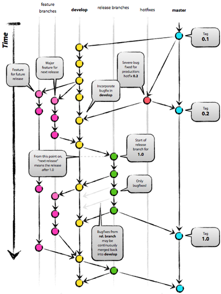

!SLIDE commandline incremental
# Demos #

	$ git commit -am 'incremental bullet points working'
	[master ac5fd8a] incremental bullet points working
	 2 files changed, 32 insertions(+), 5 deletions(-)

!SLIDE center
# I'm the Map! #

