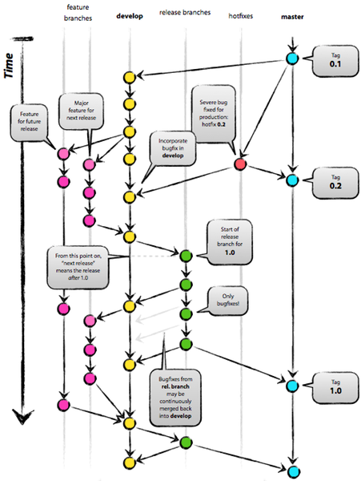
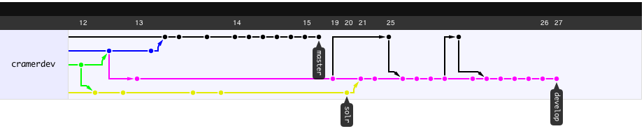

!SLIDE center
# Git-Flow#

*"A successful Git branching model"*

!SLIDE transition=scrollLeft center 

# Introduction #

**Git-flow** is a set of git **extensions** which provide high-level 
repository operations that work according to **Vincent Driessen's branching model.**

!SLIDE center 

# Introduction #

**Git-flow** is a set of git **extensions** which provide high-level 
repository operations that work according to **Vincent Driessen's branching model.**

*-translation-*

!SLIDE center

# Introduction #

**Git-flow** is a set of git **extensions** which provide high-level 
repository operations that work according to **Vincent Driessen's branching model.**

*-translation-*

There is order still in all this DVCS chaos

!SLIDE center

# Introduction #

This branching model is widely in use among **teams using git**  
as their means of source control, and **serve as a guide** to  
developing software in a **managed fashion.**

!SLIDE smbullets incremental pretty-uls 
# Truths #

* Git is **decentralized**
* When working as a team, have a **central "truth" repo** 
* Everyone **pushes** and **pulls** from the **origin**
* Can also pull from **peers**
* Or just use **branches** on the origin

!SLIDE center

# I'm the Map! #

!SLIDE center

# Friends! #

!SLIDE center
# Friends with Branches! #

